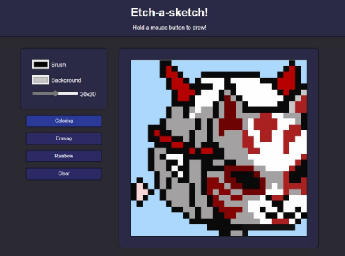

# etch-a-sketch

Simple etch-a-sketch drawing app made with JavaScript. 
Features:
- Background and color selections.
- Size adjustment of the canvas.
- Rainbow mode!

What I learned:
- To write cleaner JavaScript code (compared to my previous projects).
- New CSS properties like user-drag and user-select.

